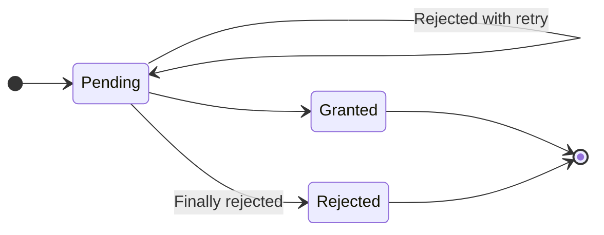
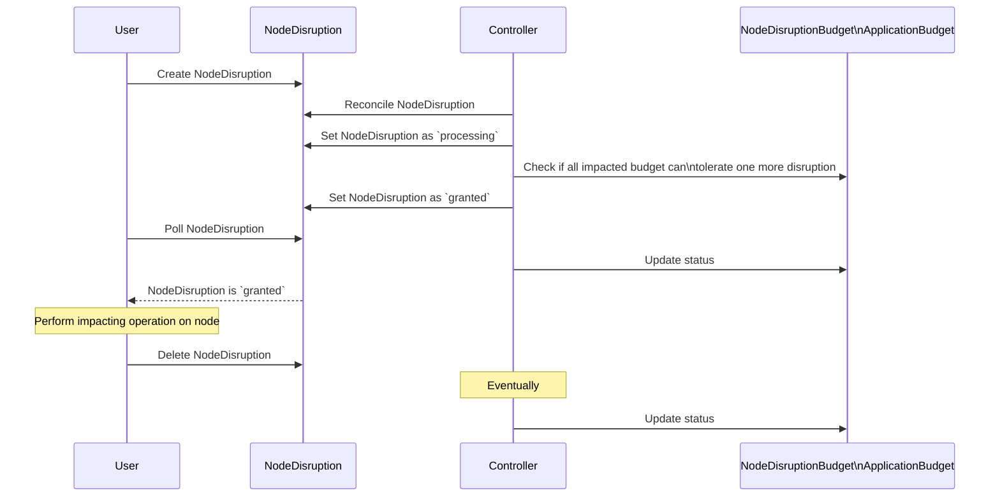

# Node Disruption Controller

Node-disruption-controller (NDC) is a way to control node disruptions (e.g. for maintenance purpose) in a Kubernetes cluster.


## Motivation

The Node Disruption Controller was built to help perform maintenance operations on Kubernetes clusters running stateful workloads, especially those reliant on local storage like databases. Nodes within a Kubernetes cluster are subject to disruptions: involuntary (like hardware failures, VM preemption, or crashes) and voluntary (such as node maintenance). Performing efficient yet safe maintenances when it involves multiple actors (different teams, different controllers) is challenging. The Node Disruption Controller provides an interface between the actors that want to perform maintenances on nodes (maintenance systems, autoscalers) and the ones that are operating services on top of these nodes.

While workload operators should build systems that are resilient to involuntary disruptions, the controller helps ensure that voluntary disruptions are as safe as they can be.


### Data protection

Stateful workloads can have both a compute and a storage component: compute is represented by the Pod and protected by PDB.
Storage is represented by Persistent Volume (PV) and PV Claims (PVC). While remote storage typically requires no special protection, local storage does. Even though stateful workloads are designed to tolerate the loss of local data, this loss is not without consequences, such as prolonged data rebalancing and/or manual intervention.

When relying on drain and PDB, data is safeguarded from eviction only if a Pod is actively running on it. Nevertheless, certain scenarios exist where Pods are not running on the node with the data, and losing a node would be costly:

- Critical rolling update: During a rolling update, Pods are restarted. If a Pod running on a node that is cordoned, preventing it from restarting on the node, the node can be drained successfully even if the PDB permits no disruptions. While the database should ideally withstand the loss of data from a single node, allowing it during a major version upgrade can be risky (database might not allow node replacement in the middle of an upgrade).
- Forced eviction on multiple pods: In real-world production environments, we've observed cases where node pressure leads to the eviction of multiple Pods within a StatefulSet. In such instances, node drains proceed without issue on nodes that forcefully evicted their pods. PDB is rendered useless. If multiple nodes enter maintenance mode simultaneously, data loss can occur.

The Node Disruption Controller addresses these concerns by providing a primitive which is data (PVC/PV) aware.


### Service level healthcheck

Kubernetes primitives and PDB only provide pod-level healthiness protection through mechanisms like liveness and readiness probes. However stateful workloads often provide service level healthiness (data redundancy status, SLA monitoring). In cases where the service is not in a healthy state, we must avoid initiating voluntary disruptions.

Unfortunately, at the moment Kubernetes doesn't provide such API. Prior to the Node Disruption Controller (NDC), we addressed this need through periodic checks, where we set `maxUnavailable=0` if the service is unhealthy. However, asynchronous health checking is dangerous as it hard to check when the last health check was made (the periodic system could be broken and the state not updated for a long time) or it cannot be fast enough and lead to multiple evictions being granted before reacting. NDC prevents these issues by providing a synchronous health checking API.

## API reference

[API reference](./DOC.md)

## Description

The primary purpose of the Node Disruption Controller (NDC) is to provide a set of APIs to ensure safety of voluntary node-level disruptions, such as maintenances. Typically, maintenance involves the eviction of pods from a node and potentially rendering the node temporarily or permanently unavailable.

The system is build around a contract: before any actions are taken on a node, a node disruption must be granted for that specific node. Once a node disruption has been granted, the requester can do what it wants (e.g., drain the node).

*The Node Disruption Controller functions as a gatekeeper* before maintenance are performed. It ensures that
performing a maintenance on a node (or a set of node) is safe by ensuring that all stakeholders (i.e. all
users of the Node) are ready for the node to enter maintenance.

It can do that by providing advanced disruption budgets (similar to PodDisruptionBudget) to workload owners.
The main type of budget provided is the Application Disruption Budget (naming is subject to change), it is
different from the PDB on the following point:
- Target PVC, to prevent maintenance even when no pods are running. This is useful when relying
  on local storage.
- Can perform a synchronous service level health check. PDB is only looking at the readiness probes of individual pods
- A pod can have more than one budget

Finally, NDC's goal is to make the implementation by the workload owners simple. Owners don't have to implement all
the features attain a level of safety they are satisfied with:
- Stateless workload owners don't have to use Node Disruption Budget as they can use PodDisruptionBudgets (PDB)
- Stateful owner can only provide a budget without service health-checking
- they can provide budget and health checking by providing an API
- they can rely on a controller and the health checking API to ensure maximum safety.


## Components


### NodeDisruption

The NodeDisruption represents the disruption of one or more nodes. The controller
doesn't make any assumption on the nature of the disruption (reboot, network down).

A nodeDisruption contains a selector to select the nodes impacted by the disruption
and a state.

#### State machine

The controller will change the state:


* Pending: the disruption has not been processed yet by the controller
* Granted: the disruption has been granted. the selected nodes can be disrupted. It should be
  deleted once the disruption is over.
* Rejected: the disruption has been rejected with a reason in the events, it can be safely deleted

##### Retry

NodeDisruption can be retried automatically. The main purpose of retry is to allow preparation for a disruption. Some disruptions cannot be allowed until some preparations operations have been completed (e.g. replicating data out of the node). A controller can consume the pending NodeDisruption, perform the required operations and finally accept the disruption when it is safe.

#### Sample object

```yaml
apiVersion: nodedisruption.criteo.com/v1alpha1
kind: NodeDisruption
metadata:
  labels:
    app.kubernetes.io/name: nodedisruption
    app.kubernetes.io/instance: nodedisruption-sample
    app.kubernetes.io/part-of: node-disruption-controller
    app.kubernetes.io/managed-by: kustomize
    app.kubernetes.io/created-by: node-disruption-controller
  name: nodedisruption-sample
spec:
  # retry:
  #   enabled: false
  #   deadline: <date after which the maintenance is not retried>
  nodeSelector: # Select all the nodes impacted by the disruption
    matchLabels:
      kubernetes.io/hostname: fakehostname
```

Example of Node Disruption with status:
```yaml
apiVersion: nodedisruption.criteo.com/v1alpha1
kind: NodeDisruption
metadata:
  name: nodedisruption-sample
spec:
  nodeSelector: # Select all the nodes impacted by the disruption
    matchLabels:
      kubernetes.io/hostname: fakehostname
status:
  disruptedDisruptionBudgets:
  - ok: false
    reason: No more disruption allowed
    reference:
      kind: ApplicationDisruptionBudget
      name: applicationdisruptionbudget-sample
      namespace: someWorkload
  - ok: true
    reason: ""
    reference:
      kind: ApplicationDisruptionBudget
      name: applicationdisruptionbudget-sample
      namespace: someWorkload2
  disruptedNodes:
  - fakehostname
  state: Pending
  retryDate: <date>
```


### ApplicationDisruptionBudget

The ApplicationDisruptionBudget provide a way to set constraints for a namespaced application
running inside Kubernetes. It can select Pod (like PDB) but also PVC (to protect data).

#### Service level healthiness

ApplicationDisruptionBudget aims at providing a way to expose service level healthiness to Kubernetes.
In some cases, an application can be unhealthy even if all its pods are running.

You can select Pods and/or PVCs.

##### PVC selector

The main reason of using a PVC selector is to ensure that node that contains data don't enter maintenance
in the event of pods not running on node.

The PVC selector only make sense if you are using local storage and PV have a nodeAffinity that is set.

##### Application level healthcheck

It is possible to configure an healthiness URL for a service. If the budget authorize one more disruption, the endpoint will be called: if the status code is different 2XX, the disruption will be rejected.

This has 2 purposes:
- Making sure the controller taking care of the application is alive
- The global state of the application is healthy

The hook will be called with a POST method containing the JSON encoded NodeDisruption the controller is trying to validate.

Note: It is not a replacement for readiness probes but a complement.

##### Freeze

Budgets support freezing disruptions. By setting `spec.Freeze.Enabled`, the budget will reject all disruptions and give the reason specified in `spec.Freeze.Reason`. 
It is equivalent to setting 0 as the max disruptions but it provide better messages.

#### Sample object

```yaml
apiVersion: nodedisruption.criteo.com/v1alpha1
kind: ApplicationDisruptionBudget
metadata:
  labels:
    app.kubernetes.io/name: applicationdisruptionbudget
    app.kubernetes.io/instance: applicationdisruptionbudget-sample
    app.kubernetes.io/part-of: node-disruption-controller
    app.kubernetes.io/managed-by: kustomize
    app.kubernetes.io/created-by: node-disruption-controller
  name: applicationdisruptionbudget-sample
spec:
  podSelector: # Optional: Select pods to protect by the budget
    matchLabels:
      app: nginx
  pvcSelect: # Optional: Select PVCs to protect by the budget
    matchLabels:
      app: nginx
  healthHook:
    url: http://someurl/health # Optional URL to call before granting a disruption
```

### NodeDisruptionBudget

The NodeDisruptionBudget the ability to limit voluntary disruptions of nodes. The main
difference with `ApplicationDisruptionBudget` is that it is not namespaced and select
nodes directly. It is a tool to control disruption on a pool of nodes.

#### Sample object

```yaml
apiVersion: nodedisruption.criteo.com/v1alpha1
kind: NodeDisruptionBudget
metadata:
  labels:
    app.kubernetes.io/name: nodedisruptionbudget
    app.kubernetes.io/instance: nodedisruptionbudget-sample
    app.kubernetes.io/part-of: node-disruption-controller
    app.kubernetes.io/managed-by: kustomize
    app.kubernetes.io/created-by: node-disruption-controller
  name: nodedisruptionbudget-sample
spec:
  maxDisruptedNodes: 1     # How many nodes can be disrupted at the same time
  minUndisruptedNodes: 10  # How many nodes should not be disrupted at the same time
  nodeSelector:  # Select Nodes to protect by the budget
    matchLabels:
      kubernetes.io/os: linux  # e.g. protect all linux nodes
```

### Sequence diagram for NodeDisruption validation



## Example of use case

### Node maintenance system

TeamK is responsible for Kubernetes itself.
TeamD is operating databases on top of the Kubernetes cluster. The database is a stateful workload
running using local persistent storage.

TeamK wants to perform maintenance of the nodes (upgrading OS, Kubelet... etc) that requires a reboot of the nodes.
TeamD wants its service to be highly available and avoid data loss.

TeamK and TeamD can use the node-disruption-controller as an interface to perform as safe as it can be maintenances.

TeamD will create an ApplicationDisruptionBudget for each of its database clusters. It will watch
for disruption on the nodes linked to its Pods and PVCs.

TeamK can create a NodeDisruptionBudget to protect the number of concurrent NodeDisruption on pool
of nodes.

TeamK, before doing a maintenance of a node will create a NodeDisruption. The controller will check
which budgets are impacted by the disruption and check if they can tolerate one more disruption.
If not, the NodeDisruption will be rejected. TeamK will have to retry creating a NodeDisruption
later.
If it is granted, TeamK can disrupt the node. In this case, the disruption will be the drain and
reboot of the Node in question.

### Node autoscaling system

The same features can apply to a Node autoscaling system that needs safely scale down a Kubernetes cluster.
Let's say the system wants to remove 10 nodes from a Kubernetes cluster. It can select nodes randomly, try to create a NodeDisruption, if it is granted, the node can be drained and removed. If it's rejected, the system can try another node or try later. The budgets ensure that all the drains and node removals are safe.

## Getting Started
You’ll need a Kubernetes cluster to run against. You can use [KIND](https://sigs.k8s.io/kind) to get a local cluster for testing, or run against a remote cluster.
**Note:** Your controller will automatically use the current context in your kubeconfig file (i.e. whatever cluster `kubectl cluster-info` shows).

### Running on a local kind cluster
1. Spawn new cluster, load the controller image on its nodes and deploy the controller:

```sh
make kind-init kind-load deploy
```

Kubeconfig is written to `KINDCONFIG` (`.kubecfg` by default).

### Running on the cluster
1. Install Instances of Custom Resources:

```sh
kubectl apply -f config/samples/
```

2. Build and push your image to the location specified by `IMG`:

```sh
make docker-build docker-push IMG=<some-registry>/node-disruption-controller:tag
```

3. Deploy the controller to the cluster with the image specified by `IMG`:

```sh
make deploy IMG=<some-registry>/node-disruption-controller:tag
```

### Uninstall CRDs
To delete the CRDs from the cluster:

```sh
make uninstall
```

### Undeploy controller
UnDeploy the controller from the cluster:

```sh
make undeploy
```

## Contributing
// TODO(user): Add detailed information on how you would like others to contribute to this project

### How it works
This project aims to follow the Kubernetes [Operator pattern](https://kubernetes.io/docs/concepts/extend-kubernetes/operator/).

It uses [Controllers](https://kubernetes.io/docs/concepts/architecture/controller/),
which provide a reconcile function responsible for synchronizing resources until the desired state is reached on the cluster.

### Test It Out
1. Install the CRDs into the cluster:

```sh
make install
```

2. Run your controller (this will run in the foreground, so switch to a new terminal if you want to leave it running):

```sh
make run
```

**NOTE:** You can also run this in one step by running: `make install run`

### Modifying the API definitions
If you are editing the API definitions, generate the manifests such as CRs or CRDs using:

```sh
make manifests
```

**NOTE:** Run `make --help` for more information on all potential `make` targets

More information can be found via the [Kubebuilder Documentation](https://book.kubebuilder.io/introduction.html)

## License

Copyright 2023.

Licensed under the Apache License, Version 2.0 (the "License");
you may not use this file except in compliance with the License.
You may obtain a copy of the License at

	http://www.apache.org/licenses/LICENSE-2.0

Unless required by applicable law or agreed to in writing, software
distributed under the License is distributed on an "AS IS" BASIS,
WITHOUT WARRANTIES OR CONDITIONS OF ANY KIND, either express or implied.
See the License for the specific language governing permissions and
limitations under the License.
