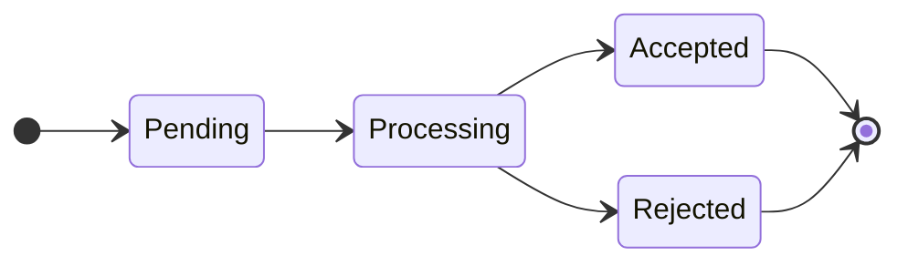

# node-disruption-controller

Node-disruption-controller is a way to control node disruptions in a Kubernetes cluster.

## Description

The main use case of the node disruption controller is to perform "impacting" maintenance on nodes.
Typically a maintenance requires draining the pods of a node then having the node unavailable
for a period of time (maybe forever).

The system is build around a contract: before doing anything on a node, a node disruption
need to be accepted for the node.

The controller is responsible for accepting node disruption. It does that by looking at
constraints provided by the disruptions budgets. The application disruption budget serve to
represent the constraints of an application running on top of Kubernetes. The main difference
with a PDB is that the Application Disruption Budget can:
- Target PVC, to prevent maintenance even when no pods are running. This is useful when relying
  on local storage.
- Can perform a synchronous service level health check. PDB is only looking at the readiness probes


## Components


### NodeDisruption

The NodeDisruption represents the disruption of one or more nodes. The controller
doesn't make any assumption on the nature of the disruption (reboot, network down).

A nodeDisruption contains a selector to select the nodes impacted by the disruption
and a state.

#### State machine

The controller will change the state:


* Pending: the disruption has not been processed yet by the controller
* Processing: the controller is processing the disruption, checking if it can be accepted or not
* Accepted: the disruption has been accepted. the selected nodes can be disrupted. It should be
  deleted once the disruption is over.
* Rejected: the disruption has been rejected with a reason in the events, it can be safely deleted

#### Sample object

```yaml
apiVersion: nodedisruption.criteo.com/v1alpha1
kind: NodeDisruption
metadata:
  labels:
    app.kubernetes.io/name: nodedisruption
    app.kubernetes.io/instance: nodedisruption-sample
    app.kubernetes.io/part-of: node-disruption-controller
    app.kubernetes.io/managed-by: kustomize
    app.kubernetes.io/created-by: node-disruption-controller
  name: nodedisruption-sample
spec:
  nodeSelector: # Select all the nodes impacted by the disruption
    matchLabels:
      kubernetes.io/hostname: fakehostname
```

Example of Node Disruption with status:
```
apiVersion: nodedisruption.criteo.com/v1alpha1
kind: NodeDisruption
metadata:
  name: nodedisruption-sample
spec:
  nodeSelector: # Select all the nodes impacted by the disruption
    matchLabels:
      kubernetes.io/hostname: fakehostname
status:
  disruptedDisruptionBudgets:
  - ok: false
    reason: No more disruption allowed
    reference:
      kind: ApplicationDisruptionBudget
      name: applicationdisruptionbudget-sample
      namespace: somecluster
  - ok: true
    reason: ""
    reference:
      kind: ApplicationDisruptionBudget
      name: applicationdisruptionbudget-sample
      namespace: somecluster2
  disruptedNodes:
  - fakehostname
  state: rejected
```


### ApplicationDisruptionBudget

The ApplicationDisruptionBudget provide a way to set constraints for a namespaced application
running inside Kubernetes. It can select Pod (like PDB) but also PVC (to protect data).

#### Service level healthiness

ApplicationDisruptionBudget aims at providing a way to expose service level healthiness to Kubernetes.
In some cases, an application can be unhealthy even if all its pods are running.

You can select Pods and/or PVCs. 


##### PVC selector

The main reason of using a PVC selector is to ensure that node that contains data don't enter maintenance
in the event of pods not running on node.

The PVC selector only make sense if you are using local storage and PV have a nodeAffinity that is set.

##### Application level healthcheck

It is possible to configure an healthiness URL for a service. If the budget authorize one more disruption
the endpoint will be called: if the status code is different 2XX, the disruption will be rejected.

This has 2 purposes:
- Making sure the controller taking care of the application is alive
- The global state of the application is healthy

It is not a replacement for readiness probes but a complement

#### Sample object

```yaml
apiVersion: nodedisruption.criteo.com/v1alpha1
kind: ApplicationDisruptionBudget
metadata:
  labels:
    app.kubernetes.io/name: applicationdisruptionbudget
    app.kubernetes.io/instance: applicationdisruptionbudget-sample
    app.kubernetes.io/part-of: node-disruption-controller
    app.kubernetes.io/managed-by: kustomize
    app.kubernetes.io/created-by: node-disruption-controller
  name: applicationdisruptionbudget-sample
spec:
  podSelector: # Optional: Select pods to protect by the budget
    matchLabels:
      app: nginx
  pvcSelect: # Optional: Select PVCs to protect by the budget
    matchLabels:
      app: nginx
  healthURL: http://someurl/health # Optional URL to call before granting a disruption
```

### NodeDisruptionBudget

The NodeDisruptionBudget the ability to limit voluntary disruptions of nodes. The main
difference with `ApplicationDisruptionBudget` is that it is not namespaced and select
nodes directly. It is a tool to control disruption on a pool of nodes.

#### Sample object

```yaml
apiVersion: nodedisruption.criteo.com/v1alpha1
kind: NodeDisruptionBudget
metadata:
  labels:
    app.kubernetes.io/name: nodedisruptionbudget
    app.kubernetes.io/instance: nodedisruptionbudget-sample
    app.kubernetes.io/part-of: node-disruption-controller
    app.kubernetes.io/managed-by: kustomize
    app.kubernetes.io/created-by: node-disruption-controller
  name: nodedisruptionbudget-sample
spec:
  maxDisruptedNodes: 1     # How many nodes can be disrupted at the same time
  minUndisruptedNodes: 10  # How many nodes should not be disrupted at the same time
  nodeSelector:  # Select Nodes to protect by the budget
    matchLabels:
      kubernetes.io/os: linux  # e.g. protect all linux nodes
```

### Sequence diagram for NodeDisruption validation


## Example of use case

### Node maintenance system

TeamK is responsible for Kubernetes itself.
TeamD is operating databases on top of the Kubernetes cluster. The database is a stateful workload
running using local persistent storage.

TeamK wants to perform maintenance of the nodes (upgrading OS, Kubelet... etc) that requires a reboot of the nodes.
TeamD wants its service to be highly available and avoid data loss.

TeamK and TeamD can use the node-disruption-controller as an interface to perform as safe as it can be maintenances.

TeamD will create an ApplicationDisruptionBudget for each of its database clusters. It will watch
for disruption on the nodes linked to its Pods and PVCs.

TeamK can create a NodeDisruptionBudget to protect the number of concurrent NodeDisruption on pool
of nodes.

TeamK, before doing a maintenance of a node will create a NodeDisruption. The controller will check
wich budgets are impacted by the disruption and check if they can tolerate one more disruption.
If not, the NodeDisruption will be rejected. TeamK will have to retry creating a NodeDisruption
later.
If it is accepted, TeamK can disrupt the node. In this case, the disruption will be the drain and
reboot of the Node in question.

### Node autoscaling system

The same features can apply to a Node autoscaling system that needs safely scale down a Kubernetes cluster.
Let's say the system wants to remove 10 nodes from a Kubernetes cluster. It can select nodes randomly, try to create a NodeDisruption, if it is accepted, the node can be drained and removed. If it's rejected, the system
can try another node or try later. The budgets ensure that all the drains and node removals are safe.

## Getting Started
You’ll need a Kubernetes cluster to run against. You can use [KIND](https://sigs.k8s.io/kind) to get a local cluster for testing, or run against a remote cluster.
**Note:** Your controller will automatically use the current context in your kubeconfig file (i.e. whatever cluster `kubectl cluster-info` shows).

### Running on the cluster
1. Install Instances of Custom Resources:

```sh
kubectl apply -f config/samples/
```

2. Build and push your image to the location specified by `IMG`:

```sh
make docker-build docker-push IMG=<some-registry>/node-disruption-controller:tag
```

3. Deploy the controller to the cluster with the image specified by `IMG`:

```sh
make deploy IMG=<some-registry>/node-disruption-controller:tag
```

### Uninstall CRDs
To delete the CRDs from the cluster:

```sh
make uninstall
```

### Undeploy controller
UnDeploy the controller from the cluster:

```sh
make undeploy
```

## Contributing
// TODO(user): Add detailed information on how you would like others to contribute to this project

### How it works
This project aims to follow the Kubernetes [Operator pattern](https://kubernetes.io/docs/concepts/extend-kubernetes/operator/).

It uses [Controllers](https://kubernetes.io/docs/concepts/architecture/controller/),
which provide a reconcile function responsible for synchronizing resources until the desired state is reached on the cluster.

### Test It Out
1. Install the CRDs into the cluster:

```sh
make install
```

2. Run your controller (this will run in the foreground, so switch to a new terminal if you want to leave it running):

```sh
make run
```

**NOTE:** You can also run this in one step by running: `make install run`

### Modifying the API definitions
If you are editing the API definitions, generate the manifests such as CRs or CRDs using:

```sh
make manifests
```

**NOTE:** Run `make --help` for more information on all potential `make` targets

More information can be found via the [Kubebuilder Documentation](https://book.kubebuilder.io/introduction.html)

## License

Copyright 2023.

Licensed under the Apache License, Version 2.0 (the "License");
you may not use this file except in compliance with the License.
You may obtain a copy of the License at

	http://www.apache.org/licenses/LICENSE-2.0

Unless required by applicable law or agreed to in writing, software
distributed under the License is distributed on an "AS IS" BASIS,
WITHOUT WARRANTIES OR CONDITIONS OF ANY KIND, either express or implied.
See the License for the specific language governing permissions and
limitations under the License.
